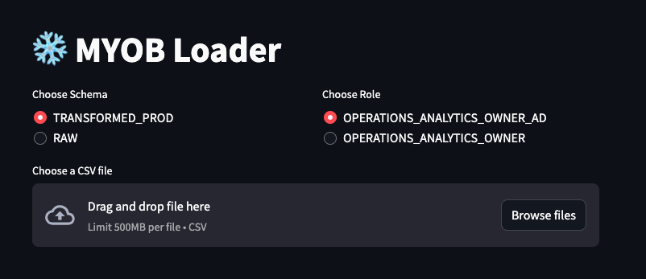

# MyobLoader

MyobLoader is a Python application that allows you to load CSV files into Snowflake.

## Installation

To install the required dependencies, run the following command:

python -m venv venv
source venv/bin/activate  # On macOS and Linux
venv\Scripts\activate     # On Windows
pip install -r requirements.txt

## How to run the script

On Windows:
*app.bat*

On Mac:
*./app*

## Usage

1. Drag and drop the CSV file you want to load into Snowflake, or select it using the "Browse files" button.
2. The CSV file should have the exact same name of the Snowflake table.
3. Select the Schema and Role that applies to the task.
4. Review the data structure being updated.
5. Upload the data.

## License

This project is licensed under the MIT License - see the [LICENSE.md](LICENSE.md) file for details.
